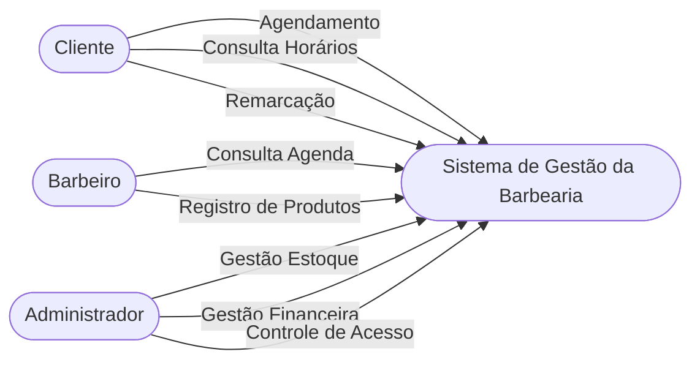
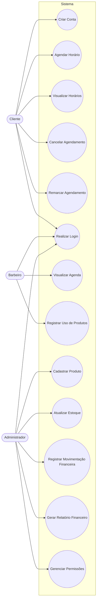
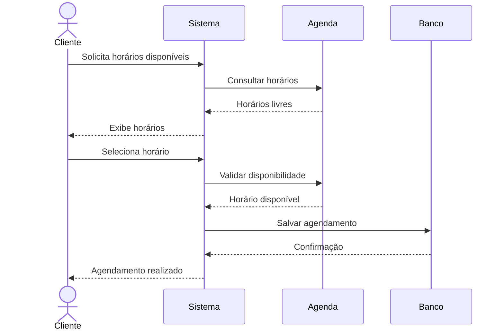
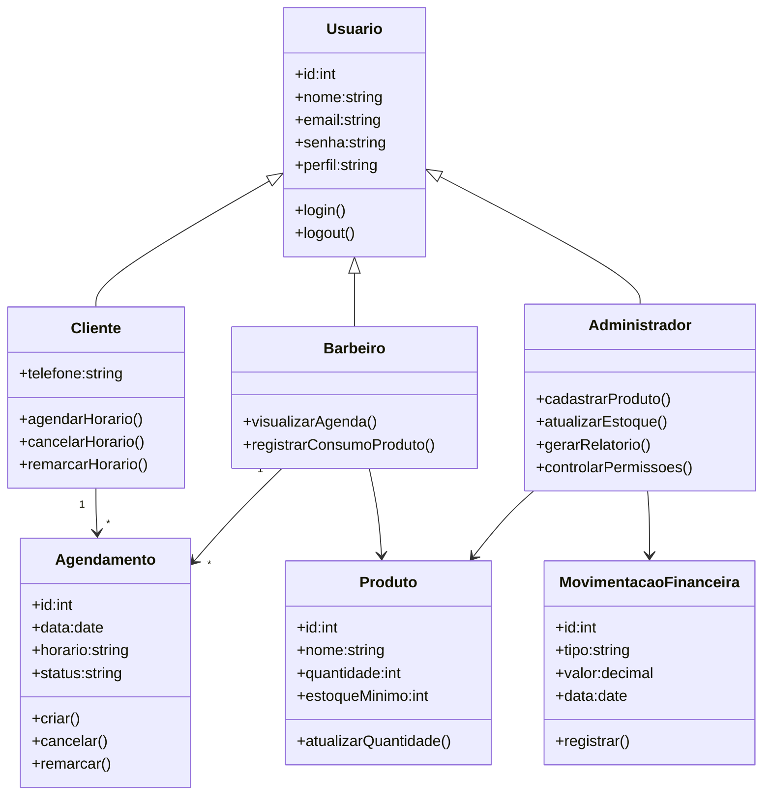

# Projeto Final - Gaio

## Etapa 2 - Sprint 1 (MVP)

### Equipe

| Nome    | Função        |
| ------- | ------------- |
| Gustavo | Desenvolvedor |
| Patrick | Desenvolvedor |
| Vicente | Product Owner |

---

# Objetivo da Sprint 1

Modelar o núcleo do sistema de gestão para barbearia utilizando UML, contemplando apenas os requisitos classificados como **Must Have**.

**Duração:** 7 dias

---

# Backlog da Sprint 1

## Cliente

* Criar conta no sistema 
* Agendar horário online 
* Visualizar horários disponíveis
* Cancelar ou remarcar horário

## Barbeiro

* Realizar login
* Visualizar agenda diária
* Registrar uso de produtos

## Administrador

* Cadastrar produtos
* Atualizar estoque 
* Registrar entradas financeiras
* Registrar saídas financeiras 
* Gerar relatórios financeiros 
* Controlar níveis de acesso

---

# Diagrama de Contexto

---

# Diagrama de Casos de Uso

---

# Diagrama de Sequência

## Fluxo Principal - Agendamento de Horário

---

# Diagrama de Classes

---
